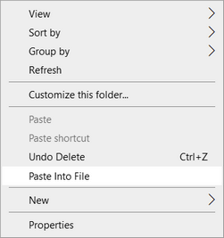
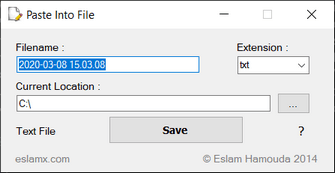

# Paste Into File

A Windows desktop application to paste clipboard contents (text and images) into files.

## Installation

### Installing via Chocolatey

You can use Chocolatey to install *Paste Into File*. If you don't have Chocolatey, you can install it from the [Chocolately Install page](https://chocolatey.org/install). With Chocolatey installed, execute the following command to install *Paste Into File*:

```powershell
choco install pasteintofile
``` 

### Installing manually

1. Make sure you have _.NET Framework 4.5._ installed in your system

1. Download the executable from [here](https://goo.gl/aBlfYQ) and install it.

## Usage

1. Right click in the folder where you want to create the file and choose the *Paste Into File* entry from the context menu:

   
   <br/>

1. Choose the filename, extenstion and location, then press the *Save* button:<br/>
   

## Configuration

Run the following commands in a terminal (Command Prompt or PowerShell).

- To add the *Paste Into File* entry in the File Explorer context menu:

   ```powershell
   .\PasteIntoFile.exe /reg
   ``` 

- To remove the *Paste Into File* entry from the File Explorer context menu:

   ```powershell
   .\PasteIntoFile.exe /unreg
   ``` 

- To change the default filename format:

   ```powershell
   .\PasteIntoFile.exe /filename yyyyMMdd_HHmmss
   ``` 
    
   For more information on the format specifiers, see [Custom date and time format strings](https://docs.microsoft.com/en-us/dotnet/standard/base-types/custom-date-and-time-format-strings).

